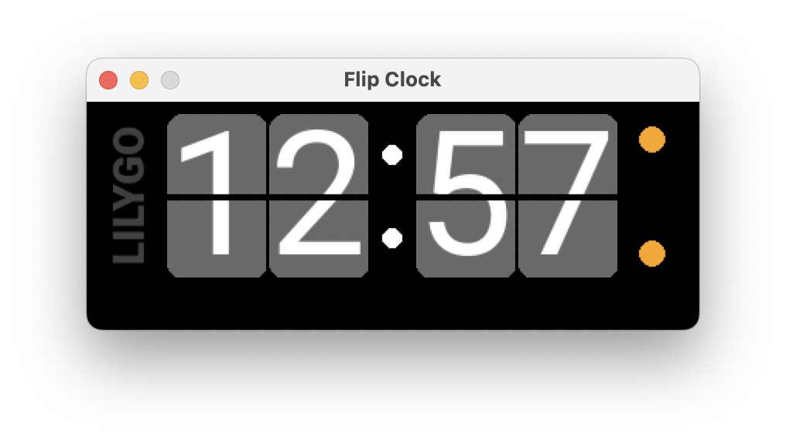
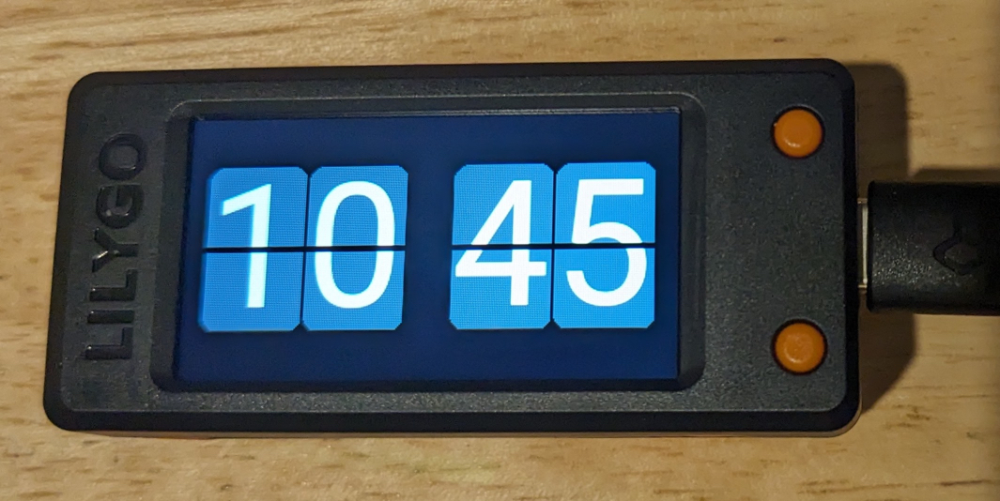

# Flip-clock with PySimpleGUI

I have been furthering my financial support of the small electronics industry by
buying a gizmo: a [LilyGo T-Display-S3](https://www.lilygo.cc/products/t-display-s3/)
which is a microcontroller with attached TFT screen. The software for it included a "flip clock"
app that, after much pain and suffering getting it to run, did not actually **flip**!
The digits are simply re-drawn at each time change without any animation.

I decided I could do a better job, but my C++ skills are 30++ years rusty, so I thought
I would prototype the general logic on my desktop using Python and
[PySimpleGUI](https://www.pysimplegui.com/) for display and
[Pillow](https://pillow.readthedocs.io/en/stable/index.html) to generate image files.

## The app:

The display will use a 5-frame animation to switch from one digit to another, and they
cascade from right to left when more than one digit changes. Here are the images shown
to change from a '0' to a '1':

..
..
..
..

The colon flashes (kind of "table stakes" for a digit clock).
The orange dots are buttons on the real device:
here the upper one rotates display formats from 24-hour to 12-hour to 12-hour with a
leading blank instead of zero. The lower button puts the display in "demo mode" which
sets the time to 12:57 (just prior to a full 4-digit change) and runs at a rate of one minute
every 6 seconds (instead of every 60 seconds as usual).

## The Code

### flip_digits.py and other_images.py

I used the Python Pillow (PIL) library to programatically generate the images in `.png`
format. The digits and colon are generated by the `flip_digits.py` program.
The `other_images.py` program generated the orange dots and logo (which won't be needed
for use on the actual device).

### clock_digit.py

This file contains classes that implement display digits.
The `ClockDigit` class implements a single display digit. Each digit has a list of
allowable characters to display that varies: the right-most one include 0-9, but the
left-most may only use 0-2, 0-1, or blank to 1, depending on the format being 24-hour, 12-hour or 12-hour with a 
leading blank.

The `ClockFace` class is a container for all 4 of the `ClockDigit` instances.

### flip_clock.py

This is the "main program" and instantiates a `ClockFace`. It is also responsible for
generating the necessary `PySimpleGUI` calls to set up the display and update it as needed.

One difference between a `PySimpleGUI` framework and the Arduino framework used on my
microcontroller is the "main loop". In `PysimpleGUI`, the loop is what is termed an
"event loop" driven by the `window.read()` calls. In the Arduino world there is also a
`loop()` function that is invoked by the system after any housekeeping tasks
(network I/O, etc.) repeatedly without waiting for an event. Therefore, the
microcontroller code must perform its own timing by measuring the differences between
readings of a system counter that increments every millisecond. I have emulated this
operation here by making use of a short `window.read(timeout=)` option `PySimpleGUI` provides along with
Python's `time.time_ns()` function. This may not be the most efficient mechanism for
timing numerous processes in Python, but many microcontrollers do not (easily) support
multi-threading tasks.

### The result

Above is a photo of the actual device using the images I generated in Python/PIL.
Actually, the microcontroller software does not efficiently display `.png` files,
so `flip_digits.py` created the images in a custom RGB565 format
(5 red bits, 6 green bits, 5 blue bits) that can be loaded from its flash memory
and fed directly to the display code.

Of course the microcontroller code is written in C++ instead of Python,
but I was able to use the classes and general processing techniques from here to
lessen the effort in getting the code to run on the device. This code will
eventually also be uploaded to GitHub in due time.
